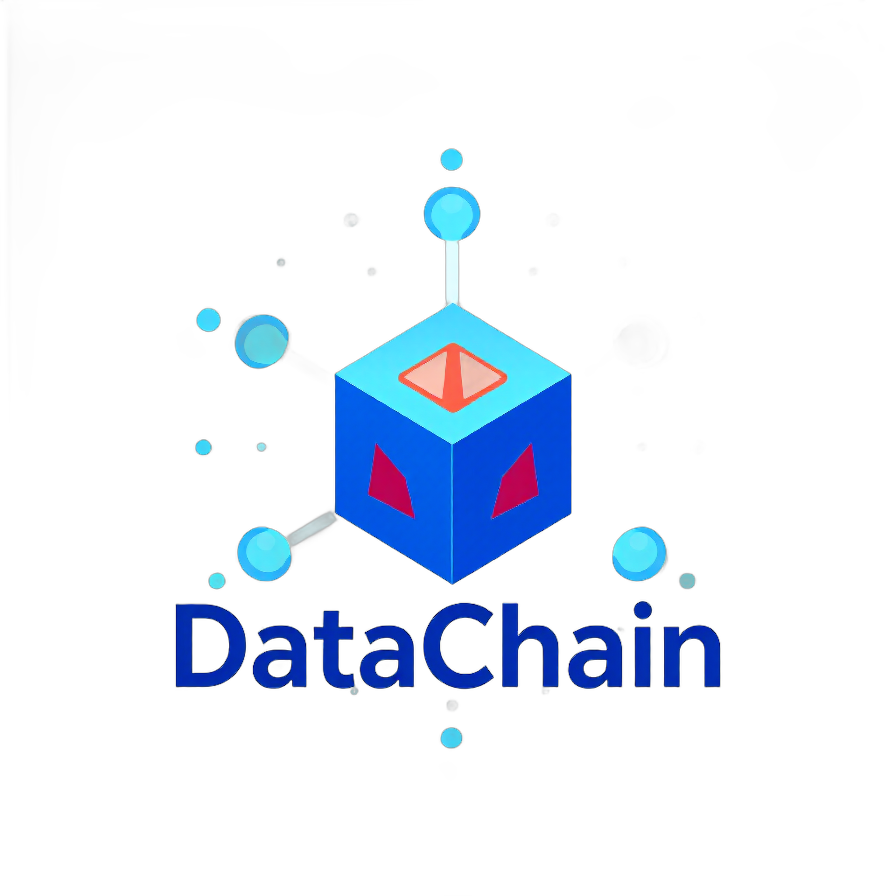

# 🌐 DataChain-Collective

<!-- Banner Dinámico -->
[//]: # ([![DataChain Collective Banner]&#40;./assets/banners/main-banner.png&#41;]&#40;https://datachain-collective.io&#41;)

<!-- Logotipo Principal -->

  

## 🚀 Mission & Purpose
We build **decentralized DataDAOs** that leverage blockchain and AI to empower data sovereignty. As part of the VANA ecosystem, we focus on:
- Creating verifiable data economies
- Developing privacy-preserving AI models
- Implementing community-governed data protocols

**Core Principles:**  
✓ Data as communal property  
✓ Transparent algorithmic governance  
✓ Ethical monetization frameworks

---

## 🗺️ Active Projects Roadmaps

| Project | Description | Status     | Roadmap |
|---------|-------------|------------|---------|
| **1. IdentityChain DAO** | KYC/AML-compliant identity verification with DAO governance | `Planning`  | [View Roadmap →](projects/identitychain/ROADMAP.md) |
| **2. AgriData Network** | IoT sensors + blockchain for sustainable agriculture | `Planning`  | [View Roadmap →](projects/agridata/ROADMAP.md) |
| **3. PharmaLedger** | Medication traceability using DataDAOs | `Planning` | [View Roadmap →](projects/pharmaledger/ROADMAP.md) |

<!-- Logos de Socios -->
## 🤝 Ecosystem
| Org | Integration |
|---------|-------------|
|  | VANA Data Tokenization |

---

## 🌱 Get Involved
- **Contribute**: [Guidelines (EN)](CONTRIBUTING.md), [Pautas (ES)](CONTRIBUTING.ES.md)
- **Discuss**: Join our [Discord](https://discord.gg/datachain_not_yet)
- **Follow**: [Twitter](https://twitter.com/datachaincol_not_yet)

> "Democratizing data value through decentralized collectives"  
> – DataChain Manifesto