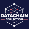

# 🌐 DataChain-Collective

> 🇪🇸 [Versión en Español disponible aquí](./README.ES.md)

<!-- Banner Dinámico -->
[//]: # ([![DataChain Collective Banner]&#40;./assets/banners/main-banner.png&#41;]&#40;https://datachain-collective.io&#41;)

<!-- Logotipo Principal -->

  

> **"Democratizing data value through decentralized collectives."**  
> — *The DataChain Manifesto*

---

## 🚀 Mission & Vision

We build **decentralized DataDAOs** that empower communities to take control of their data through blockchain and AI.

As part of the **Vana** ecosystem, we are committed to:
- Creating verifiable, user-owned data economies
- Building privacy-preserving, community-governed AI systems
- Enabling ethical and transparent monetization of data

**Core Principles**
- ✔️ Data as a public good  
- ✔️ Transparent algorithmic governance  
- ✔️ Fair distribution of value  

---

## 🗺️ Active Projects

| Project | Description | Status | Roadmap |
|--------|-------------|--------|---------|
| **IdentityChain DAO** | DAO-based identity verification that respects privacy while complying with KYC/AML norms | `Planning` | [View Roadmap →](./projects/daos/identitychain/ROADMAP.md) |
| **AgriData Network** | Crowdsourced agricultural data via IoT for climate-resilient farming | `Planning` | [View Roadmap →](./projects/daos/agridata/ROADMAP.md) |
| **NutriDAO** | Community-owned DataDAO for supplement usage data, built on OpenFHIRChain | `Planning` | [View Roadmap →](./projects/daos/nutridao/ROADMAP.md) |

---

## 🤝 Ecosystem & Partners

| Partner | Collaboration |
|--------|----------------|
|  | Data tokenization & integration with the [Vana Protocol](https://vana.com) |

---

## 🌱 Get Involved

We welcome open collaboration from developers, researchers, and data-conscious communities.

- **Contribute**: [Contribution Guidelines (EN)](CONTRIBUTING.md) | [Guía de Contribución (ES)](CONTRIBUTING.ES.md)  
- **Discuss**: Join our [Discord](https://discord.com/channels/1384877094156239039/1384877094747639810)
- **Follow**: [Twitter](https://twitter.com/datachaincol_not_yet) *(coming soon)*

Have questions or want to build with us? Feel free to open an [issue](https://github.com/datachain-collective/issues_not_yet) *(coming soon)* or connect via Discord.

---

**© 2025 DataChain Collective** — Made with ❤️ for data sovereignty and co-create smarter AI.