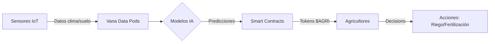

### 🌱 **Roadmap Técnico para Agricultura Inteligente con IoT + Blockchain (DataDAO) + IA**
**Integración con Vana Academy (9 semanas)**

---

#### 📚 **Weeks 1-3: Bootcamp & Learning Phase (Completado)**
**Temas cubiertos:**
- **Visión de Vana:** Arquitectura del protocolo, Data Pods, y privacidad con zk-SNARKs .
- **DataDAOs:** Creación, gobernanza tokenizada (VRC-20), y mecanismos de acceso a datos .
- **IoT relevante:** Sensores para clima, suelo, drones (ej: eBee SQ), y plataformas como CropX .

---

#### 🛠️ **Weeks 4-5: Building Phase (MVP)**
**Objetivo:** Prototipo funcional de **AgriDataDAO** (DataDAO para agricultura).

| **Componente**               | **Tecnologías**                                  | **Entregables**                                                                 |  
|------------------------------|--------------------------------------------------|---------------------------------------------------------------------------------|  
| **IoT Sensors**              | Sensores de suelo (humedad, pH), drones, estaciones meteorológicas  | Datos en tiempo real → Vana Data Pods                                            |  
| **Blockchain Layer**         | Contratos inteligentes (Solidity), tokens VRC-20, IPFS/Ceramic      | DataDAO para gobernanza; tokens $AGRI para acceso a datos                       |  
| **IA Analytics**             | Modelos predictivos (PyTorch), bibliotecas HuggingFace             | Alertas de riego/plagas; optimización de cosechas (ej: reducción 30% agua ) |  
| **Frontend**                 | React + Vana SDK                                 | Dashboard para agricultores: visualización de datos, alertas IA, token balance  |  

**Flujo de datos:**


---

#### 🚀 **Weeks 6-8: GTM Sprint**
**Estrategia de implementación:**
1. **Tokenomics Design (Semana 6):**
    - **Utility de $AGRI:** Acceso a datasets premium (ej: satélites), votación en DataDAO .
    - **Recompensas:** Agricultores ganan tokens por compartir datos de sensores .
2. **Integración Regulatoria (Semana 7):**
    - **Trazabilidad:** Blockchain para certificar origen "farm-to-fork" (ej: reducción 40% fraudes ).
    - **Cumplimiento:** Adhesión a normas GDPR/FAO usando zk-proofs .
3. **Piloto con Agricultores (Semana 8):**
    - **Socios:** Cooperativas agrícolas (ej: cultivo de lúpulo en Italia ).
    - **KPI:** 20% aumento de rendimiento con IA predictiva .

---

#### 📣 **Week 9: Demo Day**
**Presentación a inversores:**
- **Demo en vivo:**
    - Agricultor recibe alerta IA de plagas → Activa riego preciso → Transacción con token $AGRI.
- **Modelo de negocio:**  
  | **Fuente de Ingresos**       | **Ejemplo**                                  |  
  |-----------------------------|---------------------------------------------|  
  | **Venta de datos**          | Startups compran datasets para R&D  |  
  | **Suscripciones**           | Acceso premium a análisis satelitales       |  
  | **Tokens**                  | Comisión por transacciones en DataDAO       |
- **Traction:** 2 acuerdos con cooperativas (ej: optimización de riego en cultivos mediterráneos ).

---

### 💡 **Prototipo Conceptual: AgriDataDAO**
**Arquitectura:**
```mermaid
graph TB
subgraph IoT Layer
  A[Drones] --> B[Sensores de suelo]
  C[Estaciones climáticas] --> D[Satélites]
end
subgraph Blockchain
  E[DataDAO] <--> F[Smart Contracts]
  F --> G[Tokens VRC-20]
end
subgraph IA
  H[Predicción de cosechas] --> I[Optimización de recursos]
  I --> J[Alertas en tiempo real]
end
IoT Layer -->|Datos| Blockchain
Blockchain -->|Input| IA
IA -->|Output| Blockchain
```

**Componentes clave:**
1. **Capa IoT:**
    - Sensores de proximidad (humedad, pH) y drones para mapeo de cultivos .
    - Datos almacenados en **Vana Data Pods** con cifrado E2E.
2. **Capa Blockchain:**
    - **DataDAO:** Agricultores votan propuestas (ej: nuevos sensores) con tokens $AGRI .
    - **Smart Contracts:** Automatizan pagos a proveedores de insumos al cumplirse condiciones (ej: humedad óptima) .
3. **Capa IA:**
    - Modelos entrenados con datos federados (ej: predicción de rendimiento usando clima histórico) .
    - **Bibliometría:** 47.5% crecimiento anual en IA agrícola (Scopus, 2019-2024) .

---

#### 🌍 **Stack Tecnológico Recomendado**
| **Capa**         | Tecnologías Vana Native     | Complementos Externos       |  
|------------------|-----------------------------|----------------------------|  
| **Datos**        | Vana Data Pods              | LoRaWAN (bajo consumo)     |  
| **Blockchain**   | VRC-20 Tokens               | Polygon zkEVM (bajo costo) |  
| **IA**           | Federated Learning          | PyTorch + SHAP values      |  
| **Go-to-Market** | Datasets tokenizados        | Alianzas con CropX/Mothive  |  

---

### ✅ **Conclusiones**
- **Sostenibilidad:** IoT + blockchain reduce 50% desperdicio de agua y 30% emisiones CO₂ .
- **Monetización:** Agricultores ganan ingresos por datos tokenizados (ej: $0.50-$2 por dataset ).
- **Escalabilidad:** Modelo replicable en cultivos de alto valor (ej: café, viñedos) usando Vana Data Pods.

**Próximos pasos (Semana 4):**
1. Implementar contrato VRC-20 para $AGRI.
2. Conectar sensores IoT a Vana Data Pods (tutorial: `vana-iot-bridge`).
3. Entrenar modelo IA inicial con datos abiertos de FAO .

> **¡Demo Day listo para impactar!** 🌟  
> *"Datos cultivados, cosechas transformadas"* 🚜💻