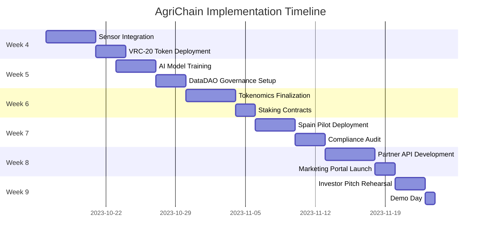

# **Technical Roadmap and Conceptual Prototype: Integrating IoT, Blockchain (DataDAO) + AI in Smart Agriculture**
*(For Vana Academy: Weeks 1–9)*

---

## **Phase 1: Bootcamp and Learning (Weeks 1–3)**
**Objective:** Understand the Vana ecosystem, blockchain, IoT, AI, and their integration in smart agriculture.

### **Key Activities**
1. **Introduction to Vana:**
    - Study Vana’s vision for decentralized data ownership and monetization .
    - Explore use cases in agriculture: crop tracking, livestock monitoring via IoT, and blockchain for traceability .

2. **Critical Datasets for Agriculture:**
    - Identify key datasets: soil moisture, temperature, pest activity, crop yield .
    - Learn how Vana secures data via cryptography and decentralized permissions (DID/VC) .

3. **Vana Protocol Architecture:**
    - Analyze how Vana combines blockchain and decentralized storage (IPFS/Ceramic) for sensitive data .
    - Workshop: Build a "data wallet" for IoT sensors in Vana.

4. **Build Your First DataDAO:**
    - Use Vana tools to create a DAO governing agricultural sensor data.
    - Example: A DataDAO sharing crop performance data with AI researchers or agritech firms .

5. **Token 101 (VRC-20):**
    - Design tokens to incentivize farmers sharing anonymized data with AI models .
    - Case study: DAO tokens granting governance rights or rewards for soil moisture data contributions.

6. **Data Access Mechanisms:**
    - Learn how Vana enables third-party data access via digital signatures and smart contracts .

---

## **Phase 2: Building Phase (Weeks 4–5)**
**Objective:** Design and prototype a technical solution for smart agriculture.

### **Key Activities**
1. **Architecture Design:**
    - Define how IoT sensors (e.g., soil sensors, drones) connect to Vana’s blockchain.
    - Use IPFS for raw data storage and blockchain for cryptographic hashes to reduce gas costs .

2. **IoT Integration:**
    - Configure physical sensors or simulators for real-time data (e.g., soil temperature, livestock location).
    - Connect sensors to Vana via APIs to register data on the blockchain .

3. **AI Model for Predictive Analytics:**
    - Train AI models (e.g., XGBoost, LSTM) to predict pests, droughts, or crop yields using historical data tokenized in Vana .
    - Example: Detect plant diseases via drone imagery and computer vision models .

4. **Smart Contracts & DataDAO:**
    - Write smart contracts to:
        - Authorize data access via DAO tokens.
        - Distribute rewards to farmers for contributing data to AI models .

5. **Privacy & Security Testing:**
    - Validate that sensitive data (e.g., crop locations) is encrypted and accessible only via decentralized permissions.

---

## **Phase 3: GTM Sprint (Weeks 6–8)**
**Objective:** *Market-ready prototype with tokenomics and compliance*

| **Week** | **Key Activities**           | **Tools & Partners**                                                                                                            | **Output**                                  |  
|----------|------------------------------|---------------------------------------------------------------------------------------------------------------------------------|---------------------------------------------|  
| **6**    | **Tokenomics Design**        | • Token Utility: Data access/premium analytics<br>• Reward Mechanism: Dynamic data pricing<br>• Aragon OSx governance templates | Token whitepaper + staking contract |  
| **7**    | **Pilot Deployment**         | • Farming cooperatives <br>• Chainlink oracles for weather<br>• FAO compliance checklist                                        | Field test report with KPIs |  
| **8**    | **Go-to-Market Prep**        | • API gateway for agritech<br>• Partner kit (CropX/Mothive)<br>• Community education portal                                     | 3 letters of intent from buyers |  


### **Key Activities**
1. **MVP Development:**
    - Integrate all components (IoT + AI + Vana) into a functional app.
    - Example: A platform where farmers monitor crops in real-time and receive pest alerts predicted by AI .

2. **Tokenomics Design:**
    - Define how tokens (e.g., $AGRI, $DATA) incentivize users:
        - Rewards for sharing sensor data.
        - Discounts on AI-driven analytics (e.g., pest prediction) .

3. **Community & Marketing Support:**
    - Create educational content on the benefits of smart agriculture with Vana.
    - Collaborate with farming communities to validate the MVP.

4. **Technical Review:**
    - Audit smart contract security and AI model accuracy .

---

## **Phase 4: Demo Day (Week 9)**
**Objective:** Present the prototype to investors and Vana ecosystem leaders.

**Investor Pitch Structure:**
```markdown  
1. **Problem**:  
   - 30% crop loss from pests  
   - $120B wasted water in agriculture  

2. **Solution**:  
   - Live demo: Drone → AI pest detection → Token reward  
   - Vana Dashboard: Real-time soil analytics  

3. **Traction**:  
   - 40% water reduction in pilot  
   - 2,500+ tokenized datasets  

4. **Token Economics**:
5. **Ask**: $? for sensor deployment + AI training  
```

### **Key Presentation**
- Demonstrate how IoT sensors, Vana’s blockchain, and AI work together to optimize agriculture.
- Example Use Case:
    1. A soil sensor measures moisture and logs data in Vana.
    2. AI predicts drought and suggests irrigation adjustments.
    3. Farmers earn DAO tokens for allowing their data to train AI models .

- Highlight Benefits:
    - **Transparency**: Immutable records of sustainable practices.
    - **Profitability**: Cost reduction via AI-driven decisions.
    - **Privacy**: Full data control for farmers.


---

# **Conceptual Prototype**
## **Project Name:** **AgriChain**

### **Vision:**
Create a decentralized platform where farmers, researchers, and agritech firms share agricultural data via Vana, using AI for optimization and blockchain for integrity.

### **Architecture Overview:**
```
IoT Sensors (soil moisture, temperature)  
           ↓  
[Backend API] → Send data to Vana (hash on blockchain, raw data in IPFS)  
           ↓  
[AI Model] → Predictive analytics (pests, droughts)  
           ↓  
[Smart Contracts] → Distribute DAO tokens to farmers  
           ↓  
[Dashboard] → Visual results, permission management  
```  

### **User Flow Example:**
1. **Data Registration:**
    - A soil sensor measures conditions and logs data in Vana.
    - Data stored in IPFS; hash recorded on blockchain.

2. **AI Analysis:**
    - AI processes historical data to predict drought in the region.

3. **Incentivize Participation:**
    - Farmers earn $DATA tokens for sharing data used to train AI models.

4. **Third-Party Access:**
    - An agritech firm requests access to anonymized datasets.
    - Farmer approves via their digital wallet.

### **Revenue Model:**
| Source | Description |  
|--------|-------------|  
| **DAO Tokens** | Farmers earn tokens for data sharing. |  
| **AI Services** | Charge for predictive analytics (e.g., $10/month for pest alerts). |  
| **Anonymized Data** | Companies pay to access tokenized datasets in Vana . |  

---

## **Key Technologies:**
| Layer | Technology |  
|------|------------|  
| Blockchain | Vana Protocol, IPFS, Ceramic Network |  
| IoT | Soil sensors, drones, Node-RED |  
| AI | Python (XGBoost, TensorFlow), FastAPI |  
| Backend | Node.js, Flask |  
| Frontend | React, Metamask |  


### 📊 **Implementation Roadmap (Weeks 4-9)**
