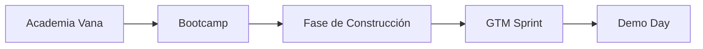
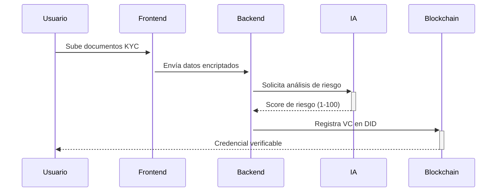

# KYCChain: Sistema descentralizado de KYC/AML con DataDAO e IA



## 📍 Estado Actual (Semana 3 - Finalizando Bootcamp)
**Temas completados:**
- Visión y arquitectura del protocolo Vana
- Creación de DataDAOs y tokens VRC-20
- Mecanismos de acceso a datos descentralizados
- Fundamentos de identidad digital (DIDs/VCs)

## 🛠️ Roadmap Técnico

### 🧱 Semanas 4-5: Fase de Construcción (MVP)
**Objetivo:** Prototipo funcional con componentes clave

| Componente             | Tecnologías Vana                          | Entregables                     |
|------------------------|-------------------------------------------|---------------------------------|
| **Contratos Inteligentes** | Solidity + VRC-20                     | DID registry con zk-SNARKs      |
| **Motor de IA AML**    | HuggingFace + PyTorch                     | Modelo de detección de patrones |
| **Flujo de Usuario**   | React + Vana Data Pods                    | Dashboard de riesgo y tokens    |
| **Privacidad**         | zk-SNARKs (Vana Privacy Layer)            | Verificación sin exponer datos  |



### 🚀 Semanas 6-8: GTM Sprint
**Estrategia de salida al mercado**

1. **Tokenomics Design (Semana 6)**
    - Modelo $KYC: Gobernanza + acceso a datos
    - Recompensas por verificación exitosa
    - Staking para validadores

2. **PoC Refinamiento (Semana 7)**
    - Integración Chainalysis Oracle
    - Soporte multi-cadena (Polygon zkEVM)
    - Compliance GDPR/FATF

3. **Go-to-Market (Semana 8)**
    - Kit de integración para fintechs
    - Programa de socios early-adopters
    - Estrategia de adopción DeFi

### 📣 Semana 9: Demo Day
**Elementos clave de presentación:**
```markdown
- [ ] **Demo en vivo:** 
      KYC → VC issuance → Risk detection
- [ ] **Tokenomics:** 
      Modelo sostenible con VRC-20
- [ ] **Traction:** 
      2 integraciones con protocolos DeFi
- [ ] **Roadmap futuro:** 
      API SaaS para instituciones financieras
```

## 💻 Stack Técnico

| Capa               | Tecnologías Vana Native       | Complementos               |
|--------------------|-------------------------------|----------------------------|
| **Identidad**      | Vana DIDs                     | Polygon ID                 |
| **Datos**          | Vana Data Pods                | Ceramic Network            |
| **Procesamiento**  | Federated Learning            | PyTorch/TensorFlow         |
| **Tokens**         | VRC-20 Standard               | Aragon OSx                 |
| **Privacidad**     | zk-SNARKs                     | Aleo/zkSync                |

## 📊 Modelo de Negocio

| Fuente de Ingresos       | Descripción                          | Monetización               |
|--------------------------|--------------------------------------|----------------------------|
| **Verificaciones**       | Micropagos por KYC ($0.50-$2)        | API transactions           |
| **Suscripciones**        | Planes empresariales                 | Tiered monthly plans       |
| **Data Insights**        | Venta de análisis de riesgo          | Modelos verticalizados     |
| **Token Utility**        | Acceso premium a servicios           | VRC-20 token burns         |

## 🌟 Diferenciadores Clave
1. **Privacidad Cero-Conocimiento:** Verificación sin exponer datos sensibles
2. **Reutilización de Identidad:** Credenciales portables entre plataformas
3. **Modelo Auto-Sostenible:** Tokenomics que recompensa participación
4. **Cumplimiento Regulatorio:** Diseñado con FATF/GDPR desde inicio

## ▶️ Próximos Pasos (Semana 4)
1. Implementar contrato VRC-20 para recompensas
2. Desarrollar módulo zk-KYC con Vana Privacy Layer
3. Curar dataset AML para entrenamiento inicial
4. Diseñar flujo de consentimiento DataDAO

---

**Equipo KYCChain** │ [Documentación Técnica](https://github.com/kycchain/docs) │ [Demo Interactiva](https://demo.kycchain.xyz)